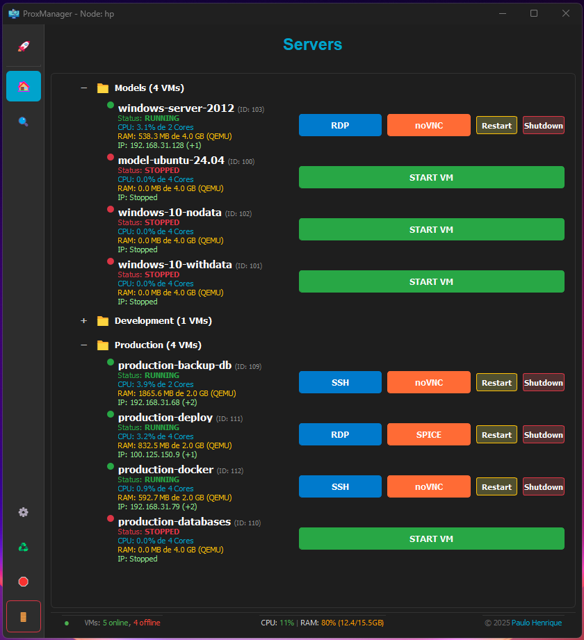

# ProxManager - Proxmox VM Manager

A native desktop application built with **Python** and **PyQt5** for quick monitoring and management of virtual machines (VMs) hosted on a Proxmox node. It's designed for users who need an instant view of server metrics and operational control over their VMs without having to access the full web interface.


# The dashboard interface (Check more on screenshots folder)




## 📝 TO-DO List and Future Improvements

 🟡 PENDING
- [ ] **Testing on Linux Environments**  
  The application was primarily developed and tested on Windows.  
  Full compatibility across Linux distributions still needs to be verified and ensured.

- [ ] **Asynchronous Action Indicators**  
  Add visual feedback (like a spinner) to buttons when executing VM actions (*Start*, *Stop*, *Reboot*) to improve the user experience.
  


---

 🟢 COMPLETED
- [x] **VNC Support for Linux Machines**  
  Remote viewing functionality is currently focused on the Windows environment.  
  The logic for opening VNC connections needs to be adapted for Linux VMs.

- [x] **RDP Support for Windows Machines**  
  Remote viewing functionality is currently focused on the Windows environment.  

- [x] **Folders Organization**  
  Add folders to place servers within them, which will make organization easier

- [x] **Configuration Screen**  
  On the settings screen, options will be added to define whether Spice will open in full screen and whether auto resize will start checked or not.

- [x] **VM Metrics Refactoring**  
  Added display of RAM usage in MB (used) vs. GB (total allocated) per VM.

- [x] **Formatting Error Fix**  
  Fixed *NoneType* and *Unknown format code* errors during application startup and Node metrics display.

- [x] **Footer Layout Improvement**  
  Implemented a two-line footer with a horizontal separator and centered copyright.


## 🚀 Features

### Main Dashboard
* **Node Overview:** Displays the current **CPU** usage, **RAM** usage, and **Load Average** of the Proxmox node.
* **Status Count:** Shows the total number of **Online** and **Offline** VMs.
* **Persistence:** Automatically saves the size and position of the main window.

### VM Management
* **Dynamic List:** Displays all VMs on the node, sorted by status (Running first) and name.
* **Detailed VM Metrics:** Displays the current **CPU** usage (in %) and **RAM** usage (in MB used vs. total GB allocated) for each VM.
* **Quick Actions:**
    * **Start/Shutdown:** Power on and shut down the VM.
    * **Restart:** Reboots the VM.
    * **SPICE:** Initiates the SPICE remote connection for the VM console.
    * **VNC:** Initiates the VNC remote connection for the VM console.

## 🛠️ Installation and Requirements

This project requires Python 3.x and the PyQt5 library, along with the Proxmox API library (`proxmoxer`).

### Dependencies

```bash
python -m venv venv
pip install -r requirements.txt
```


